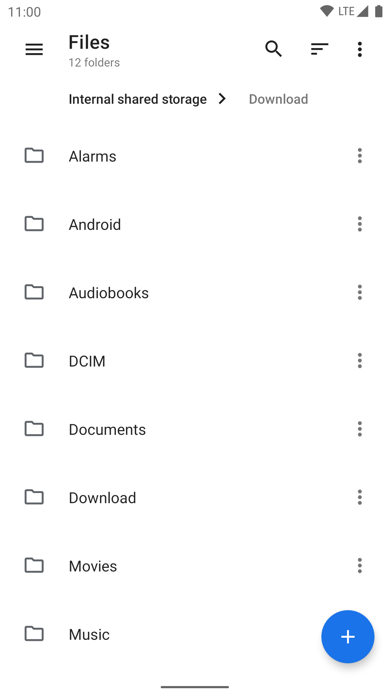
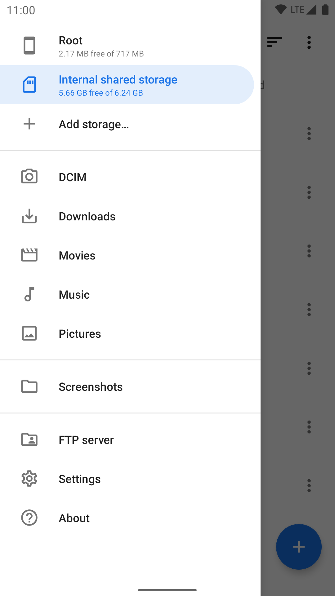
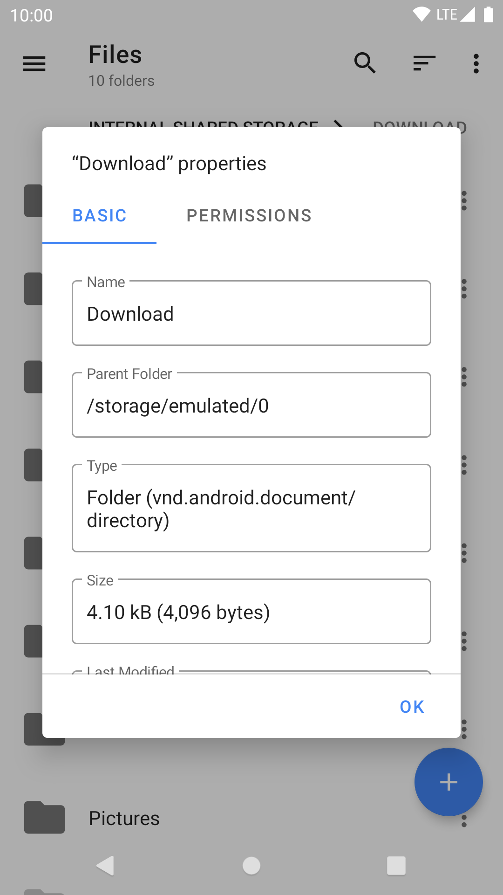
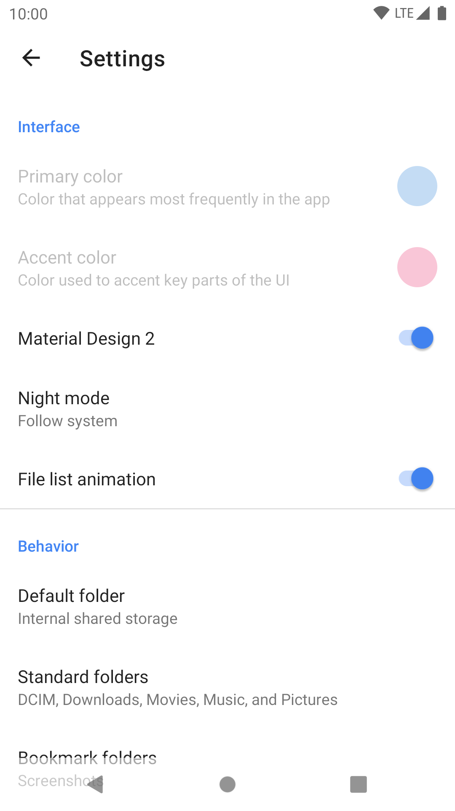
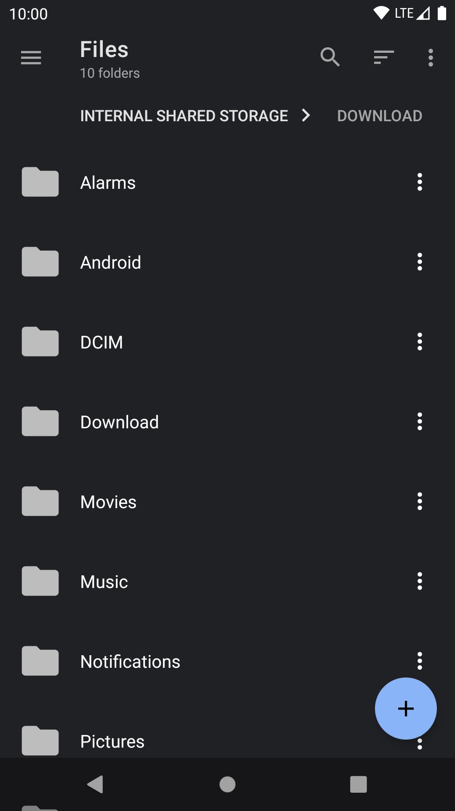
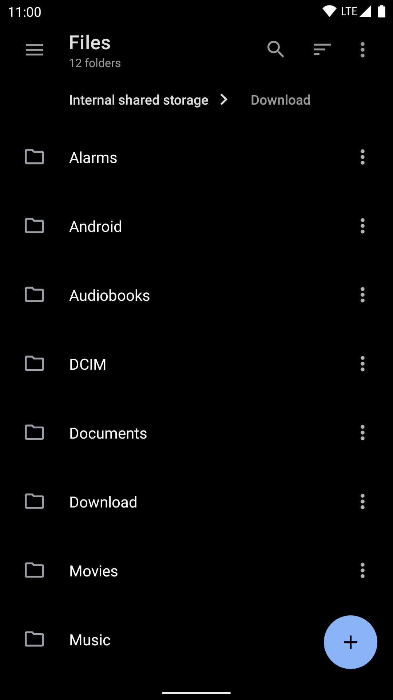

# Material Files

  

一个开源的 Material Design 文件管理器，适用于 Android 5.0+。

 

[在酷安上下载](https://www.coolapk.com/apk/me.zhanghai.android.files) [下载 APK](https://github.com/zhanghai/MaterialFiles/releases/latest/download/app-release.apk)

[在 Transifex 上帮助翻译](https://www.transifex.com/zhanghai/MaterialFiles/)（[搜索 Android 和 GNOME 的翻译](https://translations.zhanghai.me/)、[搜索微软的翻译](https://www.microsoft.com/en-us/language)、[MIME 类型翻译](https://github.com/freedesktop/xdg-shared-mime-info/tree/master/po)）

## 预览

  
  

## 特性

- 开源：轻量、简洁并且安全。
- Material Design：遵循 Material Design 规范，并且注重细节。
- 面包屑导航栏：点击导航栏所显示路径中的任一文件夹即可快速访问。
- Root 支持：使用 root 权限查看和管理文件。
- 压缩文件支持：查看、提取和创建常见的压缩文件。
- NAS 支持：查看和管理 FTP、SFTP 和 SMB 服务器上的文件。
- 主题：可定制的界面颜色，以及可选纯黑的夜间模式。
- Linux 友好：类似 [Nautilus](https://wiki.gnome.org/action/show/Apps/Files)，支持符号链接、文件权限和 SELinux 上下文。
- 健壮性：使用 Linux 系统调用实现，而不是另一个 [`ls` 解析器](https://news.ycombinator.com/item?id=7994720)。
- 实现良好：使用正确的方式打造，包括 [Java NIO2 文件 API](https://docs.oracle.com/javase/8/docs/api/java/nio/file/package-summary.html) 和 [LiveData](https://developer.android.com/topic/libraries/architecture/livedata)。

## 为什么要有 Material Files?

因为喜爱 Material Design，并且是整洁、精致的 Material Design。

市面上已经有了许多强大的文件管理器，但它们中的大多数并非 Material Design。而即使在算是 Material Design 的应用之中，它们（或多或少）有着各种设计瑕疵（布局、对齐、留白、图标、字体等等）存在于应用的各个角落，让人难受；然而却又不是特别大的问题，以至于可能没人愿意特意改善。所以还是需要自己编写。

因为想要一个开源的文件管理器。

大多数流行并且可靠的文件管理器都是闭源的，并且我有时会使用它们来查看或修改需要 root 权限的文件，但我心里对于授予 root 权限给闭源应用还是有些不安。毕竟 root 权限意味着对设备的完全访问权限，而这台设备每天跟随着我并且存储着我的个人信息；这样的话，闭源应用实际上做了哪些事情就完全仅仅取决于它们的良心了。

因为想要一个正确实现的文件管理器。

- 这个应用实现了 [Java NIO2 文件 API](https://docs.oracle.com/javase/8/docs/api/java/nio/file/package-summary.html) 作为后端，而不是发明一个自定义的机制来获取文件信息和进行文件操作。后者经常变得与前端逻辑耦合起来，最终成长为一个包含各种东西的混合物（[示例](https://github.com/TeamAmaze/AmazeFileManager/blob/master/app/src/main/java/com/amaze/filemanager/filesystem/HybridFile.java)）。相反地，一个解耦的后端可以使得代码更加干净（更少问题），并且可以更轻松地加入新文件系统的支持。

- 这个应用没有使用 `java.io.File` 或者解析 `ls` 的输出，而是构建了 Linux 系统调用的绑定来正确地访问文件系统。`java.io.File` 是一个陈旧并且缺少许多功能的 API，并且无法正确处理符号链接，因此许多人宁愿解析 `ls` 的输出。然而解析 `ls` 的输出不仅缓慢，而且[不可靠](https://news.ycombinator.com/item?id=7994720)，同时也正是 [Cabinet](https://github.com/aminb/cabinet/blob/master/app/src/main/java/com/afollestad/cabinet/file/root/LsParser.java) 在新版本 Android 上无法正确运行的原因。而通过使用 Linux 系统调用，这个应用可以做到快速流畅，并且能够处理例如 Linux 权限、符号链接以至于 SELinux 上下文等等高级特性。应用也可以正确地处理含有无效 UTF-8 编码的文件名，因为应用中的路径没有简单地使用 Java 的 `String` 存储，而大多数其他文件管理器却并非如此，因此无法正确地进行文件操作。

- 这个应用的前端是基于现代的 `ViewModel` 和 `LiveData` 实现的，使得代码结构更加清晰并且支持转屏。应用也可以正确地处理文件操作中的错误、文件冲突和前台/后台状态。

总而言之，这个应用尽力遵守 Android 上的最佳实践并且做正确的事，同时保持源代码干净和可维护。

因为事情可以被人做好。

[Nautilus](https://wiki.gnome.org/Apps/Files) 是一个设计美观并且用户友好的 Linux 桌面上的文件管理器，并且同时做到了 Linux 友好。[Phonograph](https://github.com/kabouzeid/Phonograph) 是一个开源的 Material Design 音乐播放其应用（我自己已经使用多年），而它也有着绝佳的 Material Design 设计和实现。

所以，是时候再编写一个 Android 文件管理器了。

## 在定制 ROM 中集成

如果您决定在您的定制 ROM 中集成这个应用，十分感谢！但是鉴于我曾收到过多起由不适当的集成导致的用户反馈，请允许我为了更好的用户体验提供一些关于正确集成这个应用的建议：

- 请不要使用这个应用替换 AOSP 的 [DocumentsUI](https://android.googlesource.com/platform/packages/apps/DocumentsUI/) 应用。这个应用没有被设计成 DocumentsUI 的替代品并且缺少许多 DocumentsUI 中的功能——实际上，这个应用需要 DocumentsUI 来授予外置 SD 卡的访问权限。

- 请确保这个应用可以被卸载或至少禁用。某些用户可能出于各种原因不想要这个应用，并且会在发现无法移除这个应用时十分恼火。

- 请避免和这个应用的 Play/F-Droid 版本冲突。应用商店无法更新使用了不同证书进行签名的应用，所以您可以预置一个由我（或 F-Droid）签名的 APK 以使用户能够在 Play 或 F-Droid 上更新这个应用；或者如果您需要使用其他的证书进行签名（并进行其他更改），请复刻本项目并重命名它的软件包名。

## 许可证

    Copyright (C) 2018 Hai Zhang

    This program is free software: you can redistribute it and/or modify
    it under the terms of the GNU General Public License as published by
    the Free Software Foundation, either version 3 of the License, or
    (at your option) any later version.

    This program is distributed in the hope that it will be useful,
    but WITHOUT ANY WARRANTY; without even the implied warranty of
    MERCHANTABILITY or FITNESS FOR A PARTICULAR PURPOSE.  See the
    GNU General Public License for more details.

    You should have received a copy of the GNU General Public License
    along with this program.  If not, see <https://www.gnu.org/licenses/>.
