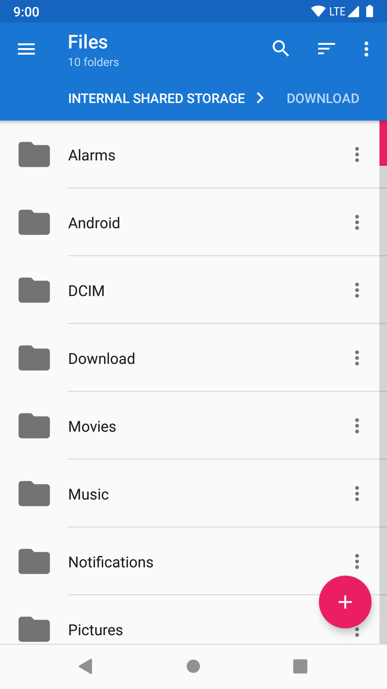
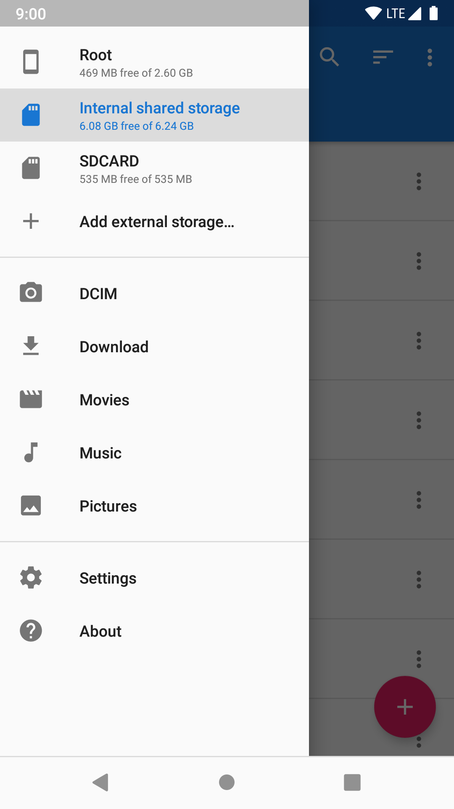
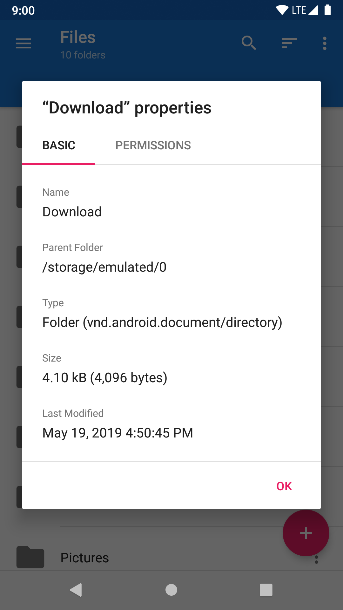
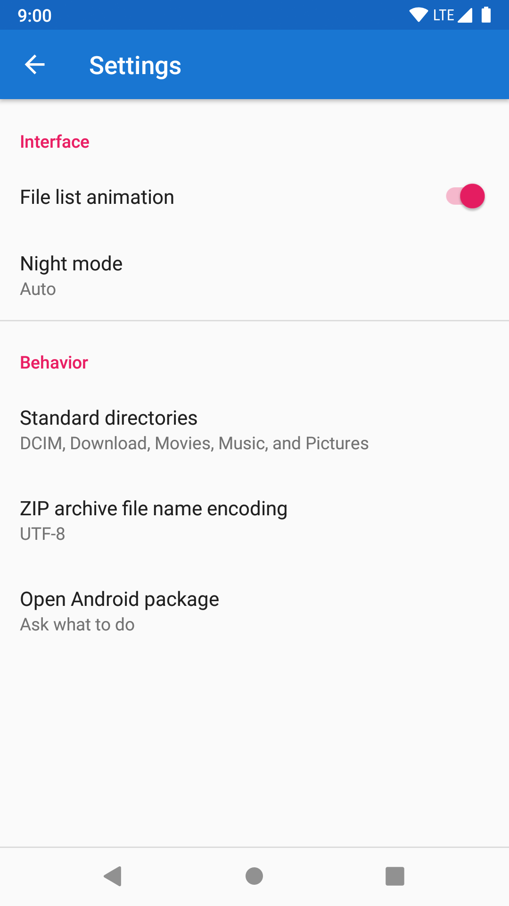
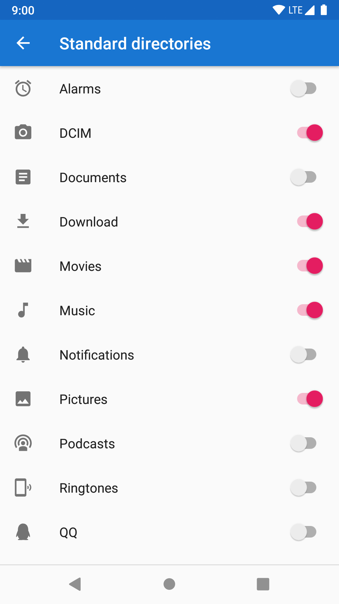
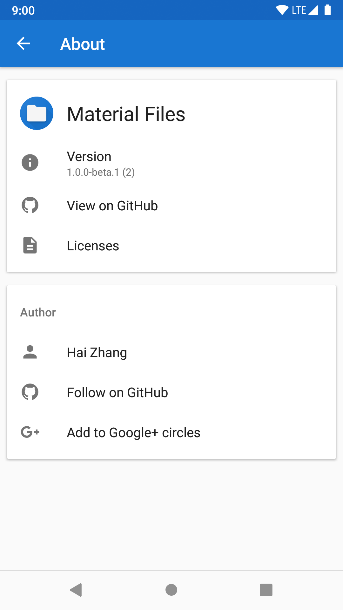

# Material Files (Beta)

一个开源的 Material Design 文件管理器，适用于 Android 5.0+。

下载：[Google Play](https://play.google.com/store/apps/details?id=me.zhanghai.android.files)、[酷安](https://www.coolapk.com/apk/me.zhanghai.android.files)、[APK](https://github.com/zhanghai/MaterialFiles/releases/download/v1.0.0-beta.7/app-release.apk)

## 预览

  
  

## 特性

- 开源：轻量、简洁并且安全。
- Material Design：仿照 [Cabinet](https://github.com/aminb/cabinet)，并且注重细节。
- 面包屑导航栏：点击导航栏所显示路径中的任一文件夹即可快速访问。
- Root 支持：使用 root 权限查看和管理文件。
- 主题：可定制的界面颜色和夜间模式。
- Linux 友好：类似 [Nautilus](https://wiki.gnome.org/action/show/Apps/Files)，支持符号链接、文件权限和 SELinux 上下文。
- 健壮性：使用 Linux 系统调用实现，而不是另一个 [`ls` 解析器](https://news.ycombinator.com/item?id=7994720)。
- 实现良好：使用正确的方式打造，包括 [Java NIO2 文件 API](https://docs.oracle.com/javase/8/docs/api/java/nio/file/package-summary.html) 和 [LiveData](https://developer.android.com/topic/libraries/architecture/livedata)。

## 为什么要有 Material Files?

因为喜爱 Material Design，并且是整洁、精致的 Material Design。

- [Cabinet](https://www.ghacks.net/2015/04/27/cabinet-is-a-feature-rich-file-explorer-for-android/) 已经不再更新了，并且在新的 Android 系统版本上无法使用。
- [Amaze File Manager](https://play.google.com/store/apps/details?id=com.amaze.filemanager) 并不支持面包屑导航栏。
- [Solid Explorer](https://play.google.com/store/apps/details?id=pl.solidexplorer2) 的波纹效果黑得奇怪。
- [Root Explorer](https://play.google.com/store/apps/details?id=com.speedsoftware.rootexplorer) 感觉有些像是某种 Holo 和 Material Design 的混合产物。
- [MiXplorer](https://play.google.com/store/apps/details?id=com.mixplorer.silver) 尽管十分强大，并不是十分 Material Design。

即使在算是 Material Design 的应用之中，它们（或多或少）有各种各样的设计瑕疵（关于布局、对齐、留白、边距、图标、字体等等）存在于应用的各个角落，让人难受，然而却又不是特别大的问题以至于可能没人会因此去特意改善。所以还是需要自己编写。

因为想要一个开源的文件管理器。

[Solid Explorer](https://play.google.com/store/apps/details?id=pl.solidexplorer2)、[Root Explorer](https://play.google.com/store/apps/details?id=com.speedsoftware.rootexplorer) 和 [MiXplorer](https://play.google.com/store/apps/details?id=com.mixplorer.silver) 都是十分强大和功能丰富的文件管理器，但是，它们都是闭源的。

我有时会使用文件管理器来查看或修改需要 root 权限的文件，但是心里对于授予 root 权限给闭源应用还是有些不安。毕竟 root 权限意味着对设备的完全访问权限，而这台设备每天跟随着我并且存储着我的个人信息，这样的话闭源应用实际上做了哪些事情就完全是仅仅取决于它们的良心了。

因为想要一个实现正确的文件管理器。

我在开始编写这个项目的代码之前参考了已有的开源应用，主要是已经停止更新的 [Cabinet](https://www.ghacks.net/2015/04/27/cabinet-is-a-feature-rich-file-explorer-for-android/) 的[源代码](https://github.com/aminb/cabinet)和 [Amaze File Manager](https://play.google.com/store/apps/details?id=com.amaze.filemanager) 的[源代码](https://github.com/TeamAmaze/AmazeFileManager)。

- 它们都建立了自己用于描述文件信息的模型（[cabinet/File.java](https://github.com/aminb/cabinet/blob/master/app/src/main/java/com/afollestad/cabinet/file/base/File.java)、[AmazeFileManager/HybridFile.java](https://github.com/TeamAmaze/AmazeFileManager/blob/master/app/src/main/java/com/amaze/filemanager/filesystem/HybridFile.java)），并且将文件的路径本身和文件的信息混合在了一个类里面。这样的抽象方式可能在开始时还能保持有序，但在开发过程中会不断膨胀臃肿，最后不可避免地变成包好了各种文件系统实现细节的混合物。

    与此同时，Java 8 已经引入了 [NIO2 文件 API](https://docs.oracle.com/javase/8/docs/api/java/nio/file/package-summary.html)。它是一个（相对）设计良好的文件系统抽象，能够涵盖 Linux, Windows and macOS 下各种文件系统的相同和不同之处，并且清晰地区分了路径的概念（`Path`）和获取文件信息的方式(`FileSystemProvider`)。

- 它们都在解析 `ls` 命令的输出（[cabinet/LsParser.java](https://github.com/aminb/cabinet/blob/master/app/src/main/java/com/afollestad/cabinet/file/root/LsParser.java)、[AmazeFileManager/RootHelper.java](https://github.com/TeamAmaze/AmazeFileManager/blob/818e6f70b68f1d8df4d615b9f629ed5bc69e791d/app/src/main/java/com/amaze/filemanager/filesystem/RootHelper.java#L296)）。一个实现良好的文件管理器[根本不应该尝试解析 `ls` 的输出](https://news.ycombinator.com/item?id=7994720)，因为完全没有办法可靠地从 `ls` 的输出中找出文件名的部分，并且如果一旦有这种解析没有处理好的文件名，应用都可能崩溃甚至导致更严重的未预期行为。此外，解析 `ls` 输出的实现需要每次启动一个新的进程，这也会显著地拖慢加载时间。并且即使应用在可能时尽量使用旧的 Java `File` API，这个 API 对符号链接的处理方式也会让应用无法正确地实现复制等文件操作。

    一个正确的解决方式应该是使用 Linux 系统调用。Android 是基于 Linux 并且使用着 Linux 的文件系统机制的，因此文件管理器也应该是 Linux 友好的。只有直接使用系统调用而不是通过某种脆弱或者功能有限的中介，文件管理器才能够正确地处理文件名、符号链接、文件拥有者和权限等等。

- 它们的源代码，例如组织或是质量，都不太能让我喜欢到愿意在其之上继续搭建出一个 Android 上最好的文件管理器。

因为这些事情可以被做好。

[Nautilus](https://wiki.gnome.org/Apps/Files) 是一个设计美观并且用户友好的 Linux 桌面上的文件管理器，并且同时做到了 Linux 友好。[Phonograph](https://github.com/kabouzeid/Phonograph) 是一个开源的 Material Design 音乐播放其应用（我自己已经使用多年），而它也有着绝佳的 Material Design 设计和实现。

所以，是时候再制作一个 Android 文件管理器了。

## 许可证

    Copyright (C) 2018 Hai Zhang

    This program is free software: you can redistribute it and/or modify
    it under the terms of the GNU General Public License as published by
    the Free Software Foundation, either version 3 of the License, or
    (at your option) any later version.

    This program is distributed in the hope that it will be useful,
    but WITHOUT ANY WARRANTY; without even the implied warranty of
    MERCHANTABILITY or FITNESS FOR A PARTICULAR PURPOSE.  See the
    GNU General Public License for more details.

    You should have received a copy of the GNU General Public License
    along with this program.  If not, see <https://www.gnu.org/licenses/>.
